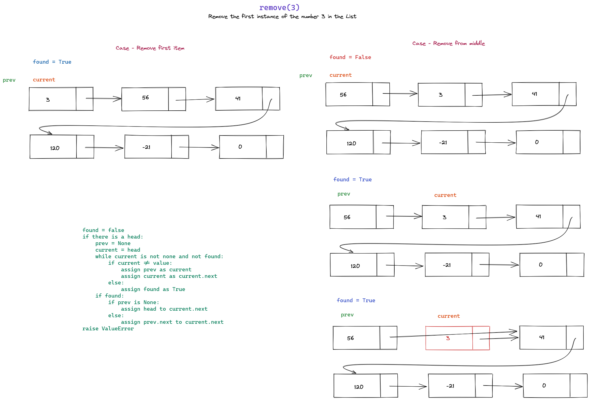

# FSDI 114 - Algorithms & Data Structures

This repository presents some exercises for designing algorithms and data structures in Python.

It presents elementary data structures, sorting and searching algorithms which will be used for designing various efficient algorithms.

## Assignment 1 - Anagram Check

Design a function called "anagram_check" which takes two strings as parameters, the function should return **True** if the two strings are anagrams, otherwise **False**.

An anagram is the rearrangement of a word or sentence into another, using only the same characters.

## Assignment 2 - Queue Class

Implement a Queue class from scratch using the Node class that was made, be sure to implement the essential *enqueue* and *dequeue* functions. You can also implement a *size* and *is_empty* functions.

## Assignment 3 - Stacks and Queues

### Stack

Implement a Stack class that allows you to:

1. Check if it is empty
2. Push a new item
3. Pop an item
4. Peek at the top item
5. Return the size

### Queue

Implement a Queue class that allows you to:

1. Check if the queue is empty
2. Enqueue (add a new item)
3. Dequeue (remove an item)
4. Return the size of the queue

## Competency Report - Lists

This competency report present class implementations for Singly Linked Lists and Doubly Linked Lists, implementing at least these methods:

1. Append - Add an item to the end of the list
2. Insert - Add an item before the specified index
3. Remove - Remove the first occurence of a value

### Append Logic

    if there is no head:
        create a new node with the given value
        assign the new node as the head
    else:
        create a current variable equal to self.head
        while current.next is not None:
            current = current.next
        assign current.next as a new Node with the specified value

### Insert Logic

    if index is less or equal to 0:
        create a new node with the given value
        assign the next attribute of new as the head of the list
        change the reference of head to the new node
    else:
        make a reference to the head as current
        set a prev variable as None 
        set a counter variable starting at 0
        while counter is less than index AND current is not None:
            assign prev equals current
            assign current equals current.next
            add +1 to counter
    
        create a new node with value
        set new.next as current
        set prev.next as new

### Remove Logic

    found = false
    if there is a head:
        prev = None
        current = head
        while current is not none and not found:
            if current != value:
                assign prev as current
                assign current as current.next
            else:
                assign found as True
        if found:
            if prev is None:
                assign head to current.next
            else:
                assign prev.next to current.next
    raise ValueError

